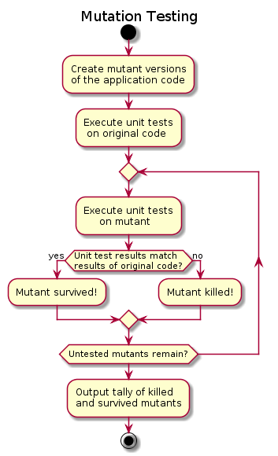

# Mutation Testing [](https://peterevans.dev/posts/mutation-testing/)
[](https://travis-ci.org/peter-evans/mutation-testing)
[](https://coveralls.io/github/peter-evans/mutation-testing?branch=master)

## What is mutation testing?

Mutation testing is a type of testing designed to assess the quality of unit tests.
This method is also sometimes described as "fault based testing" as it deliberately creates faults in software.

#### How mutation testing frameworks work



1. Small syntactic changes are made to the application code. Each change, or mutation, is applied to a separate copy of the code thus creating many versions. These versions of the application code are described as "mutants."
2. The unit test suite is run against the original application code and all the mutant copies.
3. The unit test results are compared between the original application code and mutants. If the unit test results are different then that mutant is said to be "killed." If the unit test results are the same, the mutant is said to have "survived."
4. The tally of killed and survived mutants is displayed along with the code mutation for each surviving mutant.

Here is an example where an if statement is modified to always equate to false.
Despite this change the unit test results did not change. This indicates the unit testing is poor and not covering all logical cases.
```
Mutator: IfStatement
-       if(result.length < arr[x].length) {
+       if(false) {

Ran all tests for this mutant.
Mutant survived!
```

## Why use mutation testing?

For engineers, mutation testing is a great tool to support the development of unit test suites. 
In both Test Driven Development (TDD) and writing unit tests after development, mutation testing helps fill in gaps in test suites.
Furthermore, difficult to kill mutations can often highlight problems with the code itself.
This forces engineers to rethink their logic and refactor, ultimately leading to higher quality code.

Mutation testing can also be beneficial for managers or anybody involved in evaluating code quality and individual performance.
In an ideal world, all code should be peer reviewed to a high standard, but it can be difficult to achieve and maintain within a team.
Code quality is often crudely evaluated by the unit test suite coverage of a codebase.
However, code coverage is a very poor indictor of the quality of the codebase and its test suite.
Mutation testing can provide a metric, albeit not perfect, for the quality of unit testing that is verifiable without needing to look directly at the code itself.

## Mutation Testing Frameworks

See [here](https://github.com/theofidry/awesome-mutation-testing) for a good list of frameworks for many different languages.

## Mutation testing with [Stryker](https://stryker-mutator.io/)

This repository contains a mutation testing example using [Stryker](https://stryker-mutator.io/), a mutation testing framework for the JavaScript ecosystem.
The System under test (SUT) is a Node.js module containing a simple function that returns the longest word in a sentence.

[src/index.js](src/index.js) snippet:
```javascript
module.exports.longestWord = function(str) {
  if (typeof str !== "string") return "";

  var arr = str.match(/\w[a-z]{0,}/gi);
  if (arr === null || arr.length === 0) return "";

  var result = arr[0];
  for(var x = 1; x < arr.length; x++) {
    if(result.length < arr[x].length) {
      result = arr[x];
    } 
  }
  return result;
}
```

The following test alone provides close to 100% code coverage but doesn't actually verify that the function does what it is supposed to do.
This test with no assertions is an extreme example and would no doubt be caught by code review, but just shows how easy it is to create poor unit tests.

[test/test.js](test/test.js) snippet:
```javascript
  it('should return the longest word', function(done) {
    var sentence = 'Ladies and gentlemen, the truth is that mutants are very real, and that they are among us.';
    stringFormatter.longestWord(sentence);
    done();
  });
```

Running the Stryker mutation test framework reveals that the unit testing is very poor.
20 mutants survived!

```
Ran 1.00 tests per mutant on average.
----------|---------|----------|-----------|------------|----------|---------|
File      | % score | # killed | # timeout | # survived | # no cov | # error |
----------|---------|----------|-----------|------------|----------|---------|
All files |    9.09 |        2 |         0 |         20 |        0 |       0 |
index.js  |    9.09 |        2 |         0 |         20 |        0 |       0 |
----------|---------|----------|-----------|------------|----------|---------|
```

Killing those 20 mutants required four unit tests that can be seen [here](test/test.js).
Further unit tests could be written but for the purposes of this example only those required to kill the mutants are shown.

## Mutation testing in production

If you have a large codebase you will soon find that testing against hundreds or thousands of mutants takes a long time!
Rather than hooking it directly in to your CI pipeline you might consider running the process once per night.

## License

MIT License - see the [LICENSE](LICENSE) file for details
